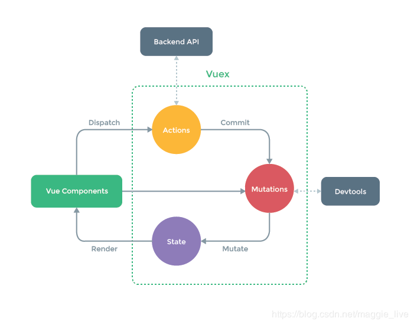

---
title: vue 12种通信方式
date: 2019-08-14
---

### Vue组件间的通信方式
#### 1. props传递数据
在父组件中使用儿子组件
```html
<template>
 <div>
  父组件:{{mny}}
  <Son1 :mny="mny"></Son1>
 </div>
</template>

<script>
import Son1 from "./Son1";
export default {
 components: {
  Son1
 },
 data() {
  return { mny: 100 };
 }
};
</script>
```
在子组件中获取父组件的mny值
```html
<template>
  <div>
    子组件：{{subMny}}
  </div>
<template>

<script>
export default {
  props: {
    mny: String
  },
  data() {
    return {
      subMny: this.mny
    }
  }
}
</script>
```
#### 2.$emit使用
子组件出发父组件的方法
```html
/* 父组件 */
<template>
 <div>
  父组件:{{mny}}
  <Son1 :mny="mny" @input="change"></Son1>
 </div>
</template>
<script>
import Son1 from "./Son1";
export default {
 methods: {
  change(mny) {
   this.mny = mny;
  }
 },
 components: {
  Son1
 },
 data() {
  return { mny: 100 };
 }
};
</script>
```
子组件触发绑定自身的方法
```html
/* 子组件 */
<template>
 <div>
  子组件1: {{mny}}
  <button @click="$emit('input',200)">更改</button>
 </div>
</template>
<script>
export default {
 props: {
  mny: {
   type: Number
  }
 }
};
</script>
```

#### 3.sync实现数据双向绑定，从而同步父子组件数据，父组件可以修改子组件，子组件也可以修改父组件
```html
<Son1 :mny.sync="mny"></Son1>
<!-- 触发的事件名 update:(绑定.sync属性的名字) -->
<button @click="$emit('update:mny',200)">更改</button>

<!--等价于-->
<!-- 父组件-->
<Son1 :mny="mny" @update.mny="val => mny = val"></Son1>
<button @click="$emit('update:mny',200)">更改</button>
```

#### 4.v-model
```html
<Son1 v-model="mny"></Son1>
<!--等价于-->
<Son1 v-bind:value="mny" v-on:input="mmy = $event.target.value"></Son1>

<template>
 <div>
  子组件1: {{value}} // 触发的事件只能是input
  <button @click="$emit('input',200)">更改</button>
 </div>
</template>
<script>
export default {
 props: {
  value: { // 接收到的属性名只能叫value
   type: Number
  }
 }
};
</script>
```
写自定义组件select的时候发现没有input事件，要如何才是使用v-model？
```java
   Vue.component('vue-select', {
      model: {
        prop: 'checked',
        event: 'change'
      },
      props: {
        checked: Boolean,
        // this allows using the `value` prop for a different purpose
        value: String
      },
      // ...
    })
 ```
新增model属性值里面有两个key，分别为prop、event，值分别为checked、change。model属性值里的两个key就是v-model的语法糖所代表的的prop和event，分别表示该单元素的值和改变元素值的触发事件，在input中，这两个值value和input默认值，在checkout中表示checked和change，select中表示selected和change。
```html
<!--父组件-->
<mui-select
  v-bind:selected="parentValue"
  v-on:change="parentValue = arguments[0]">
</mui-select>

<!--子组件-->
<select :value="selected" @change="handleChange($event.target.value">
  <template v-for="item in selectData">
    <option :value="item.value">{{item.text}}</option>
  <template>
<select>

<script>
export default{
  model: {
    prop: "selected",
    event: "change"
  },
  props: {
    selectData: Array,
    selected: {
      type: [String, Number]
    }
  },
  methods: {
    handleChange(val) {
      this.$emit('change', val)
    }
 }
 </script>
```

#### 5. $parent, $children属性传递
```html
<Grandson1 :value="value"></Grandson1>
<template>
 <div>
  孙子:{{value}}
  <!-- 调用父组件的input事件 -->
  <button @click="$parent.$emit('input',200)">更改</button>
 </div>
</template>
<script>
export default {
 props: {
  value: {
   type: Number
  }
 }
};
</script>
```

#### 6. $dispatch
既然能向上派发也可以向下派发
```javascript
Vue.prototype.$dispatch = function $dispatch(eventName, data) {
  let parent = this.$parent;
  while(parent) {
    parent.$emit(eventName, data);
    parent = parent.$parent;
  }
};
```

#### 7.$broadcast
```javascript
Vue.prototype.$broadcast = function $broadcast(eventName, data) {
  const broadcase = function() {
    this.$children.forEach(child => {
      child.$emit(eventName, data);
      if(child.$children){
        $broadcast.call(child, eventName, data)
      }
    });
  };
  broadcast.call(this, eventName, data);
};
```

#### 7. $attr 批量向下传入属性
```html
<Son2 name="小珠峰" age="10"></Son2>

<!-- 可以在son2组件中使用$attrs属性,可以将属性继续向下传递 -->
<div>
  儿子2: {{$attrs.name}}
  <Grandson2 v-bind="$attrs"></Grandson2>
</div>


<template>
 <div>孙子:{{$attrs}}</div>
</template>
```

#### 8.$listeners批量向下传入方法
```html
<Son2 name="小珠峰" age="10" @click="()=>{this.mny = 500}"></Son2>
<!-- 可以在son2组件中使用listeners属性,可以将方法继续向下传递 -->
<Grandson2 v-bind="$attrs" v-on="$listeners"></Grandson2>

<button @click="$listeners.click()">更改</button>
```

#### 9. provide&inject
provide 在父组件中注入数据
```java
provide() {
  return { parentMsg: "父亲" };
}
```
inject 在任意子组件中可以注入父组件数据
```java
inject: ['parentMsg']; // 会将数据挂载在当前实例上
```

#### 10.Ref获取组件实例
```html
<Grandson2 v-bind="$attrs" v-on="$listeners" ref="grand2"></Grandson2>
mounted() { // 获取组件定义的属性
  console.log(this.$refs.grand2.name);
}
```

#### 11.eventBus用于跨组件通知
```java
Vue.prototype.$bus = new Vue();
```
son2组件
```java
mounted() {
  this.$bus.$on('my', data=> {
    console.log(data);
  });
},
```
grandson1组件
```java
mounted() {
  this.$nextTick(() => {
    this.$bus.$emit('my', '我是grandson1’）
  })
}
```

#### 12.vuex 状态管理

