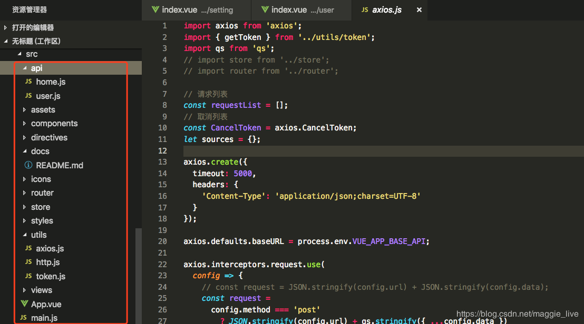
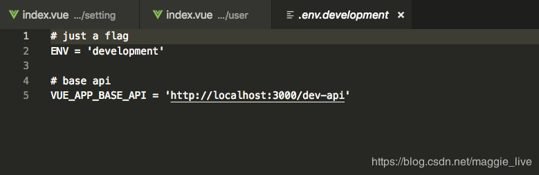
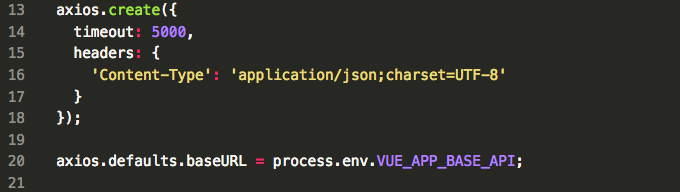

---
title: vue-cli 统一封装axios，使用拦截器统一出来请求前和请求后处理
date: 2019-05-13
---

Axios是基于Promise机制实现的异步的链式请求框架。体积小，源码易懂。非常适合做基础的请求库。拦截器的作用，在请求钱对发送的数据、逻辑进行处理，或者在响应后对响应数据做处理。
请求前处理
 - 配置相同的请求数据，如headers、token
 - 添加loading效果
 
 # 1.axios的封装
 ### 1.使用vue-cli创建项目
 
首先在vue-cli项目的src路径下新建utils和api文件夹，在utils文件夹里新建axios.js和http.js， api文件用于写业务上接口，对axios的封装写在axios.js里，项目目录结构如下：

### 2.axios统一封装
  - 首先使用终端命名引入axios、qs依赖，引入vant移动端UI库显示loading等。

> npm i axios qs --save
> npm i vant --save
```
import axios from 'axios';
import qs from 'qs';
import vant from 'vant';
```
  - 创建一个axios实例，这个process.env.VUE_APP_BASE_API在.env.developmet、.env.production中进行配置
  
  
  - axios实例创建好之后，开始使用request拦截器对axios请求配置做统一处理。请求拦截器的作用是在请求发送前进行一些操作，例如在每个请求体里加上token，统一做了处理如果以后要改也非常容易。具体如下：
  ```
  // request拦截器==>对请求参数做处理
axios.interceptors.request.use(config => {
    Toast.loading({
      mask: true,
      message: "加载中..."
    });
 
    config.method === 'post'
        ? config.data = qs.stringify({...config.data})
        : config.params = {...config.params};
    config.headers['Content-Type'] = 'application/x-www-form-urlencoded';
 
    return config;
}, error => {  //请求错误处理
    Toast.fail(error);
    Promise.reject(error)
});
```
- 然后对response做统一的处理。响应拦截器的作用是在接收到响应后进行一些操作，例如在服务器返回登录状态失效，需要重新登录的时候，跳转到登录页。
```
//添加一个响应拦截器
axios.interceptors.response.use(
res => {
    let result;
    switch (res.status) {
      case 404:
        console.log("404");
        break;
      case 500:
        console.log("服务器出错");
        break;
      case 401:
        console.log("401");
        break;
      case 200:
        let data = res.data;
        if (data.respCode === '0000') {
          result = data.data;
        }else{
          vant.fail(error)
        }
        break;
    }
    //在这里对返回的数据进行处理
    return result;
  }, 
  error => {
    return Promise.reject(error);
  });
  ```

#### axios.js完整文档
```
import axios from 'axios';
import qs from 'qs';

axios.create({
  timeout: 5000,
  headers: {
    'Content-Type': 'application/json;charset=UTF-8'
  }
});

axios.defaults.baseURL = process.env.VUE_APP_BASE_API;

axios.interceptors.request.use(config => {
    Toast.loading({
      mask: true,
      message: "加载中..."
    });
 
    config.method === 'post'
        ? config.data = qs.stringify({...config.data})
        : config.params = {...config.params};
    config.headers['Content-Type'] = 'application/x-www-form-urlencoded';
 
    return config;
}, error => {  //请求错误处理
    Toast.fail(error);
    Promise.reject(error)
});

axios.interceptors.response.use(
  res => {
    let result;
    switch (res.status) {
      case 404:
        console.log("404");
        break;
      case 500:
        console.log("服务器出错");
        break;
      case 401:
        console.log("401");
        break;
      case 200:
        let data = res.data;
        if (data.respCode === '0000') {
          result = data.data;
        }else{
          vant.fail(error)
        }
        break;
    }
    //在这里对返回的数据进行处理
    return result;
  }, 
  error => {
  return Promise.reject(error);
});

export default axios; //暴露axios实例
```
- 封装axios的get、post等方法
```
import Vue from 'vue';
import axios from './axios';
// import 'mint-ui/lib/style.css';
import { Toast } from 'vant';
Vue.component(Toast);

/**
 * 封装get方法
 * @param url
 * @param data
 * @returns {Promise}
 */
export function get(url, params = {}) {
  return new Promise((resolve, reject) => {
    axios
      .get(url, {
        params: params
      })
      .then(response => {
        resolve(response.data);
      })
      .catch(err => {
        reject(err);
      });
  });
}

/**
 * 封装post请求
 * @param url
 * @param data
 * @returns {Promise}
 */
export function post(url, data = {}) {
  return new Promise((resolve, reject) => {
    axios.post(url, data).then(
      response => {
        resolve(response.data);
      },
      err => {
        reject(err);
      }
    );
  });
}

/**
 * 封装get方法
 * @param url
 * @param data
 * @returns {Promise}
 */ export function fetch(url, params = {}) {
  return new Promise((resolve, reject) => {
    axios
      .get(url, {
        params: params
      })
      .then(response => {
        resolve(response.data);
      })
      .catch(err => {
        reject(err);
      });
  });
}

/**
 * 封装patch请求
 * @param url
 * @param data
 * @returns {Promise}
 */ export function patch(url, data = {}) {
  return new Promise((resolve, reject) => {
    axios.patch(url, data).then(
      response => {
        resolve(response.data);
      },
      err => {
        reject(err);
      }
    );
  });
}
/**
 * 测试接口
 * 名称：exam
 * 参数：paramObj/null
 * 方式：fetch/post/patch/put
 */

/**
 * 下面是获取数据的接口
 */ export const server = {
  exam: function(paramObj) {
    return post('/api.php?ac=v2_djList', paramObj);
  }
};

```
# 2.axios接口的调用方式
 axios已经封装好了，接下来就具体去使用axios，前面我们也说过把业务上的接口统一写在api文件夹里，在api下创建use.js，根据不同的业务创建不同文件，这样做是为了方便我们后续便于维护业务上的api。笔者之前也尝试直接写在统一文件下，但是到了项目后期业务变得非常庞大之后，就花费很多时间在维护上了。

 - 在main.js中加入下面代码
 ```
 import Vue from 'vue';
 import { get, post } from './utils/http';
 
Vue.prototype.$get = get;
Vue.prototype.$post = post;
```

- 在api/use.js中创建
```
export const getUserInfo = params => {
  return get('/user/info', params);
};
```
- 在具体的组件中进行调用index.vue
```
import { getUserInfo } from '../api/use.js';

export default {
  methods: {
    getUse: async function() {
      const params = {
        username: 'admin',
      }
      let res = await getUserInfo(params);
   }
```
