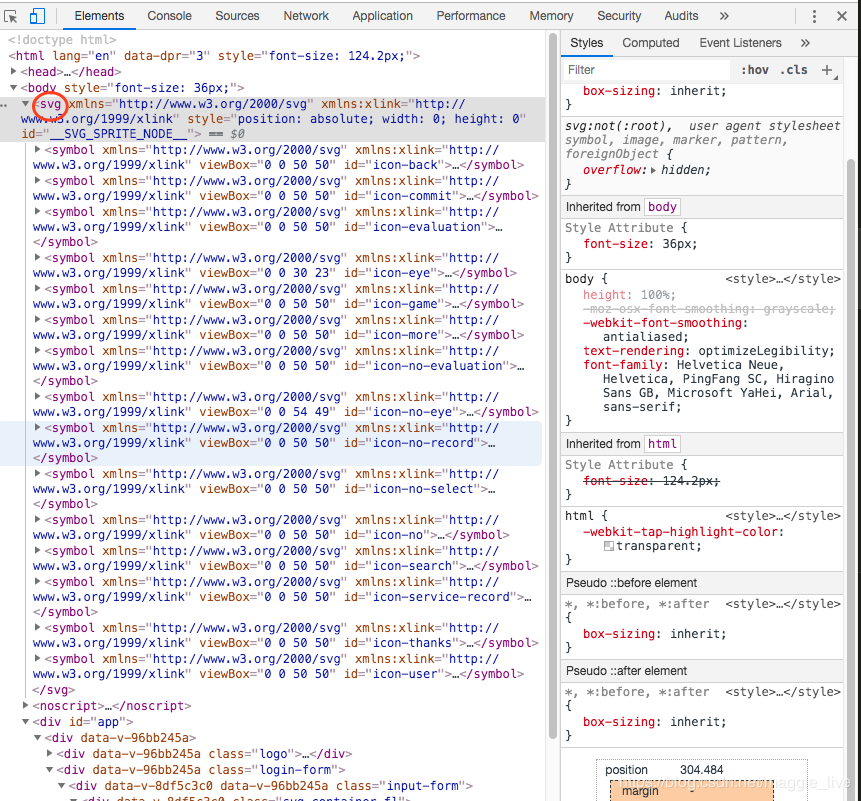
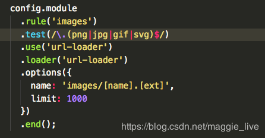

---
title: vue-cli3 使用svg-sprite-loader的使用
date: 2019-05-13
---

## 1.为什么使用svg-sprite-loader？

> 用来根据导入的svg文件自动生成symbol标签并插入html，接下来就可以在模板忠方便地使用svg-sprite技术了

 通常我们项目都是使用[iconfont阿里巴巴图标矢量库](https://www.iconfont.cn/home/index?spm=a313x.7781069.1998910419.2)，**缺点：**
  - 操作繁琐，每次ui需要加一些新的图标的时候，都要重新下载图标库的项目，然后把整体的文件（其中包括css,svg,ttf,woff等）替换掉。
  - 如果更改名称的话，需要在图标库里改一次，然后进行下载复制拷贝。
  - iconfont网站库图标内容有限，特殊业务条件需要uimm们自己设计的图(PSD小图标变身SVG Sprites/font-face历险记)

**[svg](https://cn.vuejs.org/v2/cookbook/editable-svg-icons.html)优点：**
  - 图标易于实时修改
  - 图标可以带动画
  - 可以使用标砖的prop和默认值来将图标保持在一个典型的尺寸并随时按需改变他们
  - 图标是内联的，所以不需要额外的HTTP请求
  - 可以动态地使得图标可访问


 ## 2.实现svg-sprite-loader
 1. 使用终端命名引入
 > cnpm i svg-sprite-loader --save-dev
 2. 在vue.config.js配置文件中增加svg的配置
 ```
     // set svg-sprite-loader
    config.module
      .rule('svg')
      .exclude.add(resolve('src/icons'))
      .end();
    config.module
      .rule('icons')
      .test(/\.svg$/)
      .include.add(resolve('src/icons'))
      .end()
      .use('svg-sprite-loader')
      .loader('svg-sprite-loader')
      .options({
        symbolId: 'icon-[name]'
      })
      .end();
```
  **注意**
   - options可以不要，默认的id是svg的文件名=name；
   - 使用svg时，id形式与symbol保持一致；
   ```
   <template>
  <svg :class="svgClass" aria-hidden="true" v-on="$listeners">
    <use :xlink:href="iconName" />
  </svg>
</template>

<script>
export default {
  name: 'SvgIcon',
  props: {
    iconClass: {
      type: String,
      required: true
    },
    className: {
      type: String,
      default: ''
    }
  },
  computed: {
    iconName() {
      return `#icon-${this.iconClass}`;
    },
    svgClass() {
      if (this.className) {
        return 'svg-icon ' + this.className;
      } else {
        return 'svg-icon';
      }
    }
  }
};
</script>

<style scoped>
.svg-icon {
  width: 1em;
  height: 1em;
  vertical-align: -0.15em;
  fill: currentColor;
  overflow: hidden;
}
</style>
```
   - 引入svg图标，为了方便可吧所有svg图标放在同一个文件夹中，同一个js脚本文件把这些svg图标全部引入
 ```
 import Vue from 'vue';
import SvgIcon from '@/components/SvgIcon'; // svg组件

// register globally
Vue.component('svg-icon', SvgIcon);

const req = require.context('./svg', false, /\.svg$/);
const requireAll = requireContext => requireContext.keys().map(requireContext);
requireAll(req);

export default req;
```
- 在main.js中引入对应index.js，图标就可以正常显示了。

在body下有一个svg标签，里面整合了所有的svg图标，每个symbol都有对应ID。


- 项目开发中到中期时，svg图标就突然不能正常显示，排期好几天，后面才发现由于引入url-load对图片进行处理base64格式问题，导致svg规则被清除


这里需要把svg删除
```
config.module
      .rule('images')
      .test(/\.(png|jpg|gif)$/) <= 删除svg
      .use('url-loader')
      .loader('url-loader')
      .options({
        name: 'images/[name].[ext]',
        limit: 1000
      })
      .end();
```
- 具体组件中使用
```
 <svg-icon v-if="icon" icon-class="user"></svg-icon>
```
