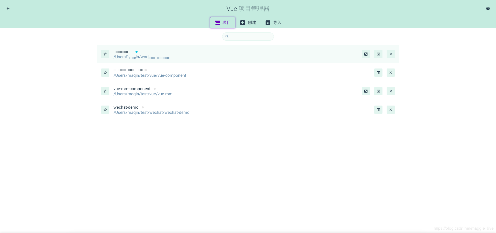
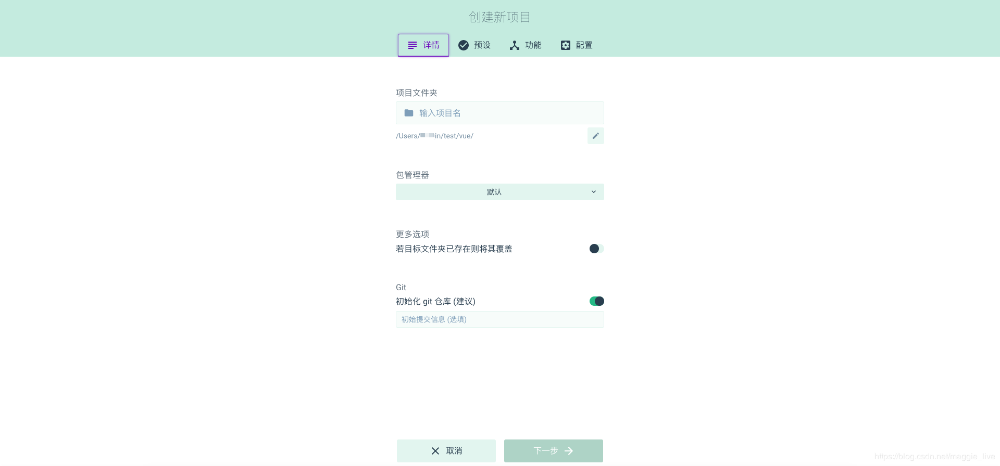
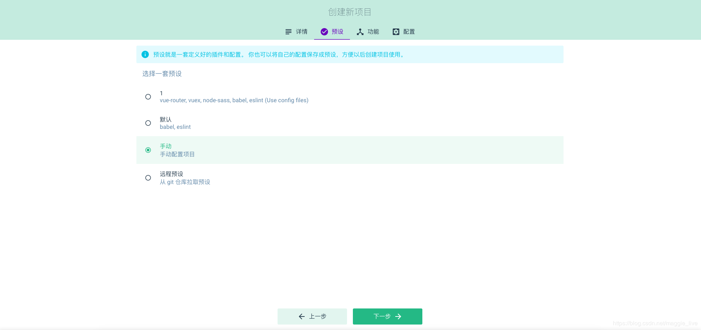
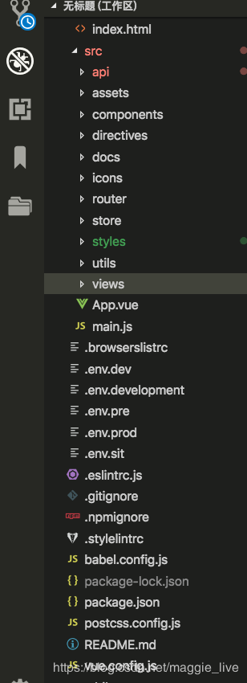

---
title: vue-cli3创建项目（1）
date: 2019-7-12
---

### 创建项目
1. 打开新的终端 / 命令行窗口。
2. 使用命令*npm i -g @vue/cli*。
3. 运行完后输入命令vue ui，浏览器上自动打开http://localhost:8000地址。
4. 浏览器打开显示:
5. 点击创建

6. 手动配置项目

7. 选择功能，可以引入babel、TypeScript、Progressive Web App（PWA）Support、Router、Vuex等功能，具体看你项目的需要。

8. 选择好配置之后，点击创建项目就开始安装，到这步你就创建好一个新的项目。
项目的目录结构

### vue.config.js
```JavaScript
'use strict';
const path = require('path');
const BundleAnalyzerPlugin = require('webpack-bundle-analyzer')
  .BundleAnalyzerPlugin; //打包分析

function createUuid() {
  var d, formatter, uid;
  d = Date.now();
  formatter = 'xxxx-xxxx';
  uid = formatter.replace(/[xy]/g, function(c) {
    var r;
    r = (d + Math.random() * 16) % 16 | 0;
    d = Math.floor(d / 16);
    if (c === 'x') {
      return r.toString(16);
    } else {
      return ((r & 0x7) | 0x8).toString(16);
    }
  });
  return '' + uid.replace(/-/g, '').toLowerCase();
}
let RUNTIME_HASH = createUuid();

function resolve(dir) {
  return path.join(__dirname, dir);
}

const mockPort = 3000; // mock server port
const IS_PROD = ['production', 'prod'].includes(process.env.NODE_ENV);

const BUILD_RELEASE = process.env.BUILD_RELEASE
  ? process.env.BUILD_RELEASE
  : '';
const CDN_HOST_BUILD_REALSE = process.env.CDN_HOST
  ? process.env.CDN_HOST + '/' + BUILD_RELEASE
  : process.env.VUE_APP_CDN_HOST + '/' + BUILD_RELEASE;

const REASE_VERSION = process.env.BUILD_RELEASE
  ? process.env.BUILD_RELEASE + '/'
  : '';

module.exports = {
  publicPath:
    process.env.NODE_ENV === 'development' ? '/' : CDN_HOST_BUILD_REALSE,
  // outputDir: `dist`${REASE_VERSION}`,
  lintOnSave: false, // 关闭eslint规范
  productionSourceMap: true, // 生产环境的 source map
  assetsDir: `${REASE_VERSION}`,
  devServer: {
    headers: {
      'Access-Control-Allow-Origin': '*',
      'Access-Control-Allow-Methods': 'GET, POST, PUT, DELETE, PATCH, OPTIONS',
      'Access-Control-Allow-Headers':
        'X-Requested-With, content-type, Authorization'
    },
    open: IS_PROD,
    hot: true,
    overlay: {
      warnings: false,
      errors: true
    },
    proxy: {
      [process.env.VUE_APP_BASE_API]: {
        changeOrigin: true, //开启代理：在本地会创建一个虚拟服务端，然后发送请求的数据，并同时接收请求的数据，这样服务端和服务端进行数据的交互就不会有跨域问题
        target: `http://localhost:${mockPort}`,
        ws: true, // 是否启用websocket
        pathRewrite: {
          ['^' + process.env.VUE_APP_BASE_API]: ''
        }
      }
    }
  },
  filenameHashing: true,
  css: {
    extract: true, // 是否使用css分离插件,采用独立样式文件载入，不采用<style></style>内嵌到html文件中
    sourceMap: false
  },
  chainWebpack(config) {
    config.plugins.delete('preload'); // TODO: need test
    config.plugins.delete('prefetch'); // TODO: need test

    // config.entry.app = ['babel-polyfill', './src/main.js'];
    config.output.chunkFilename(`${REASE_VERSION}js/[name].[hash].js`); // import 异步加载模块名称

    // set svg-sprite-loader
    config.module
      .rule('svg')
      .exclude.add(resolve('src/icons'))
      .end();
    config.module
      .rule('icons')
      .test(/\.svg$/)
      .include.add(resolve('src/icons'))
      .end()
      .use('svg-sprite-loader')
      .loader('svg-sprite-loader')
      .options({
        symbolId: 'icon-[name]'
      })
      .end();

    // lib目录是组件库最终打包好存放的地方，不需要eslint检查
    // src/docs是存放md文档的地方，也不需要eslint检查
    config.module
      .rule('eslint')
      .exclude.add(path.resolve('lib'))
      .end()
      .exclude.add(path.resolve('src/docs'))
      .end();
    // packages和src目录需要加入编译
    config.module
      .rule('js')
      .include.add(/packages/)
      .end()
      .include.add(/src/)
      .end()
      .use('babel')
      .loader('babel-loader')
      .tap(options => {
        // 修改它的选项...
        return options;
      });

    config.module
      .rule('images')
      .test(/\.(png|jpg|gif|jpeg)$/)
      .use('url-loader')
      .loader('url-loader')
      .options({
        name: `${REASE_VERSION}images/[name].[ext]`,
        limit: 1000,
        // 压缩图片
        mozjpeg: { progressive: true, quality: 80 },
        optipng: { enabled: false },
        pngquant: { quality: '70-95', speed: 5 },
        gifsicle: { interlaced: false },
        webp: { quality: 80 }
      })
      .end();

    // set preserveWhitespace
    config.module
      .rule('vue')
      .use('vue-loader')
      .loader('vue-loader')
      .tap(options => {
        options.compilerOptions.preserveWhitespace = true;
        return options;
      })
      .end();

    //添加别名
    config.resolve.alias.set('@', resolve('src'));

    // 打包分析
    if (process.env.IS_ANALYZ) {
      config.plugin('webpack-report').use(BundleAnalyzerPlugin, [
        {
          analyzerMode: 'static'
        }
      ]);
    }

    if (IS_PROD) {
      config.plugins = config.plugins.concat(
        new UglifyJsPlugin({
          uglifyOptions: {
            compress: {
              warnings: true,
              drop_console: true,
              drop_debugger: true,
              pure_funcs: ['console.log'] //移除console
            },
            mangle: false,
            output: {
              beautify: true //压缩注释
            }
          },
          sourceMap: false,
          parallel: true
        }),
        new CompressWebpackPlugin({
          filename: '[path].gz[query]',
          algorithm: 'gzip',
          test: new RegExp('\\.(' + ['js', 'css'].join('|') + ')$'),
          threshold: 10240,
          minRatio: 0.9
        })
      );
    }

    config.when(process.env.NODE_ENV === 'development', config =>
      config.devtool('cheap-source-map')
    );

    config.when(process.env.NODE_ENV !== 'development', config => {
      config
        .plugin('ScriptExtHtmlWebpackPlugin')
        .after('html')
        .use('script-ext-html-webpack-plugin', [
          {
            inline: `runtime\..*\.js$/`,
            defaultAttribute: 'async'
          }
        ])
        .end();
      config.optimization.splitChunks({
        chunks: 'all',
        cacheGroups: {
          libs: {
            name: 'chunk-libs', // 基础类库
            test: /[\\/]node_modules[\\/]/,
            priority: 10, // 权重
            chunks: 'initial' // only package third parties that are initially dependent
          },
          commons: {
            name: 'chunk-commons',
            test: resolve('src/components'), // can customize your rules
            minChunks: 3, //  minimum common number
            priority: 5,
            reuseExistingChunk: true
          }
        }
      });
      config.optimization.runtimeChunk({
        name: `js/runtime.${RUNTIME_HASH}`
      });
    });
  }
};
```

### [环境变量和模式](https://cli.vuejs.org/zh/guide/mode-and-env.html#%E6%A8%A1%E5%BC%8F)
项目根目录中的下列文件来指定环境变量：
```sh
.env.dev     开发环境
.env.sit     测试环境
.env.prod    线上环境

//env.dev 
NODE_ENV='development'
VUE_APP_API_HOST = ‘http://localhost:8080'   // 访问本地mock数据
```
package.json文件中增加相应的命令行
```sh

"scripts": {
    "serve": "vue-cli-service serve",
    "build": "vue-cli-service build",
    "lint": "vue-cli-service lint",
    "mock": "node mock/server.js",
    "build:dev": "vue-cli-service build --mode dev",
    "build:sit": "vue-cli-service build --mode sit",
    "build:prod": "vue-cli-service build --mode prod"
  },
```
###  统一封装axios
修改vue.config.js
```sh
module.exports = {
  chainWebpack: config => {
    // 这里是对环境的配置，不同环境对应不同的BASE_URL，以便axios的请求地址不同
    config.plugin('define').tap(args => {
      args[0]['process.env'].API_HOST = JSON.stringify(process.env.API_HOST)
      return args
    })
  }
}
```
然后在src中新建一个utils文件夹，创建一个axois.js来配置axios
```sh

// src/api/axios.js
import axios from 'axios';
import router from '../router';
import { Toast } from 'vant';
const service = axios.create({
  timeout: 5000, // 设置超时时间
  baseURL: process.env.VUE_APP_API_HOST
});
// post请求的时候，我们需要加上一个请求头，所以可以在这里进行一个默认的设置
// 即设置post的请求头为application/x-www-form-urlencoded;charset=UTF-8
service.defaults.headers.post['Content-Type'] = 'application/x-www-form-urlencoded;charset=UTF-8';

/**
 * 请求前拦截
 * 用于处理需要在请求前的操作
 */
service.interceptors.request.use(config => {
  const token = localStorage.getItem('token');
  if (token) {
    config.headers['Authorization'] = token;
  }
  return config;
}, (error) => {
  return Promise.reject(error);
});

/**
 * 请求响应拦截
 * 用于处理需要在请求返回后的操作
 */
service.interceptors.response.use(response => {
  const responseCode = response.status;
  if (responseCode === 200) {
    return Promise.resolve(response);
  } else {
    return Promise.reject(response);
  }
}, error => {
  // 可以根据后端返回的状态码进行不同的操作
  const responseCode = error.response.status;
  switch (responseCode) {
    // 401：未登录
    case 401:
      // 跳转登录页
      router.replace({
        path: '/login',
        query: {
          redirect: router.currentRoute.fullPath
        }
      })
      break
    // 403: token过期
    case 403:
      // 弹出错误信息
      Toast('登录信息过期，请重新登录');
      // 清除token
      localStorage.removeItem('token');
      // 跳转登录页面，并将要浏览的页面fullPath传过去，登录成功后跳转需要访问的页面
      setTimeout(() => {
        router.replace({
          path: '/login',
          query: {
            redirect: router.currentRoute.fullPath
          }
        });
      }, 1000);
      break
    // 404请求不存在
    case 404:
      Toast('网络请求不存在');
      break
    // 其他错误，直接抛出错误提示
    default:
      Toast(error.response.data.message);
  }
  //断网或者请求超时状态
  if(!error.response){
    if (error.message.includes('timeout')) {
      Toast('请求超时，请检查网络是否连接正常')
    } else {
      Toast('请求失败，请检查网络是否已连接')
    }
    return
  }
  return Promise.reject(error)
})

export default service;
```

