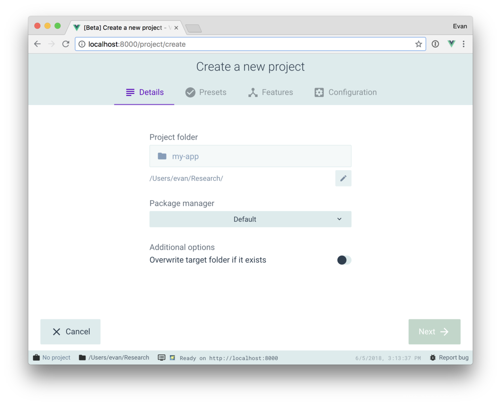
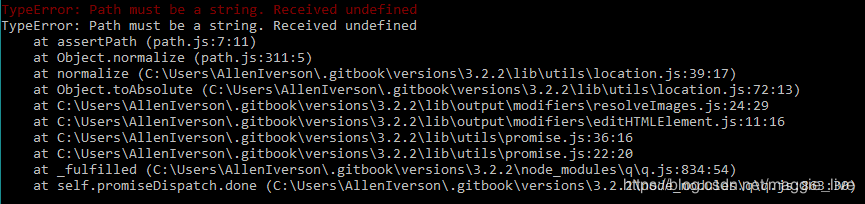

---
title: vue-cli3报错 Jest TypeError_ Path must be a string. Received undefined
date: 2019-01-11
---

通过命令安装最新的vue-cli
  
```
npm install -g @vue/cli
or
yarn global add @vue/cli
```
通过命令vue ui 打开图形化界面的报错


报错信息


这是环境变量导致的，安装node的时候默认安装目录是在系统变量中，而node全局安装包的目录是在用户的path中。系统查询可执行文件的属性是先查询系统path变量，然后在查询用户path变量，所以node安装目录下的npm就覆盖了node全局安装目录下的npx。

**解决办法：**
  把用户path变量下的node全局安装路径复制到系统变量path中。

**注意：**
如果是默认全局安装node的目录，一是”C:\Users{your_user_name}\AppData\Roaming\npm”),注意一定要把这个路径放在node安装目录前面，因为查找是从上到下查找的。 

通过[github上的issue](https://github.com/zkat/npx/issues/144)找到其他人解决办法，可以通过手动升级到最新版本npx解决

    npm I -g npx

