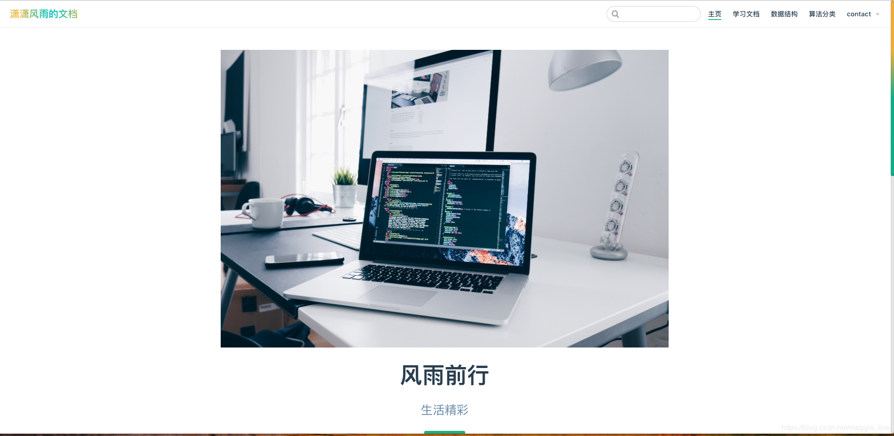
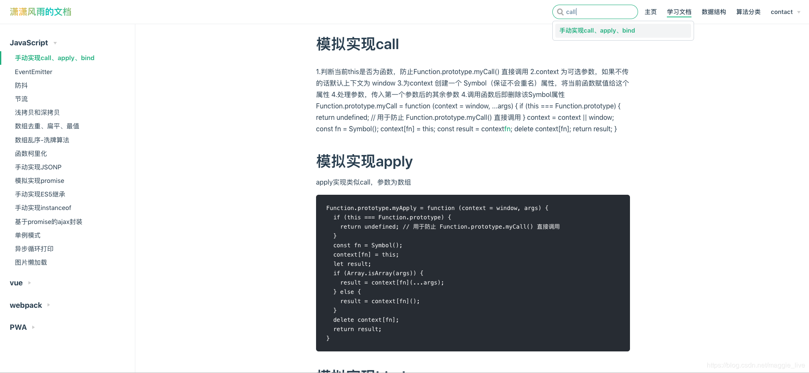

[[toc]]

## 前言

本文基于[VuePress1.x](https://v1.vuepress.vuejs.org)版本。VuePress由两部分组成：

- 一个极简静态网站生成器，界面十分简洁，容易上手；
- 为书写技术文档而优化的默认主题，为了支持Vue及其子项目的文档需求。

## 它是如何工作的

一个VuePress网站是一个由Vue、Vue Router和Webpack驱动的单页应用。在构建时，创建一个服务端渲染（SSR）的版本，然后通过虚拟访问每一条路径来渲染对应的HTML。

### VuePress特性

- 为技术文档而优化的 内置 Markdown 拓展
- 在 Markdown 文件中使用 Vue 组件的能力
- Vue 驱动的自定义主题系统
- 自动生成 Service Worker
- 内置和[Algolia](https://community.algolia.com)搜索
- Google Analytics 集成
- 基于 Git 的 “最后更新时间”
- 多语言支持
- 默认主题包含：

  + 响应式布局
  + 可选的主页
  + 简洁的开箱即用的标题搜索
  + Algolia 搜索
  + 可自定义的导航栏 和侧边栏
  + 自动生成的 GitHub 链接和页面的编辑链接

## 效果





## 快速上手

### 全局安装

```bash
# 安装
yarn global add vuepress # 或者：npm install -g vuepress

# 新建一个 markdown 文件
echo '# Hello VuePress!' > README.md

# 开始写作
vuepress dev .

# 构建静态文件
vuepress build .
```

### 现有项目

已经有项目，只是想在该项目中管理文档，则应该将VuePress安装为本地依赖。作为本地依赖安装让你可以使用继承工具，或者一些其他服务来帮助你每次提交代码时自动部署

```bash
# 将 VuePress 作为一个本地依赖安装
yarn add -D vuepress # 或者：npm install -D vuepress

# 新建一个 docs 文件夹
mkdir docs

# 新建一个 markdown 文件
echo '# Hello VuePress!' > docs/README.md

# 开始写作
npx vuepress dev docs
```

::: warning 注意
如果你的现有项目依赖了 webpack 3.x，推荐使用 [Yarn](https://yarnpkg.com/zh-Hans/) 而不是 npm 来安装 VuePress。因为在这种情形下，npm 会生成错误的依赖树。
:::

### 项目初始化

```bash
yarn init -y or npm init -y
```

在`package.json`里加一些脚本

```json
{
  "scripts": {
    "docs:dev": "vuepress dev docs",
    "docs:build": "vuepress build docs"
  }
}
```

使用`npm run docs:dev`命令运行开发环境，使用`npm run docs:build`打包生成静态HTML文件。默认情况下，打包后的dist文件在`./vuepress/dist`，可以通过配置`.vuepress/config.js`中的`dest`字段修改

### 目录结构

VuePress 遵循 “约定优于配置” 的原则，推荐的目录结构如下：

:::tip

```catalog
├── docs
│   ├── .vuepress (可选的) 用于存放全局的配置、组件、静态资源等
│   │   ├── components (可选的) Vue组件将会被自动注册为全局组件
│   │   ├── theme (可选的) 用于存放本地主题
│   │   │   └── Layout.vue
│   │   ├── public (可选的) 静态资源目录
│   │   ├── styles (可选的) 用户存放样式相关文件
│   │   │   ├── index.styl 将会被自动应用的全局样式文件，会生成在最终的css文件结尾，具有比默认样更高级的优先级
│   │   │   └── palette.styl 用于重写默认样式常量，或者设置新的stylus颜色常量
│   │   ├── templates (可选的, 谨慎配置) 存储HTML模板文件
│   │   │   ├── dev.html
│   │   │   └── ssr.html
│   │   ├── config.js (可选的) 配置文件的入口文件
│   │   └── enhanceApp.js (可选的) 客户端应用的增强
│   │
│   ├── README.md
│   ├── guide
│   │   └── README.md
│   └── config.md
│
└── package.json
```

:::

## [基本配置](https://vuepress.vuejs.org/zh/config/#%E5%9F%BA%E6%9C%AC%E9%85%8D%E7%BD%AE)

一个VuePress网站必要的配置文件`.vuepress/config.js`，它应该导出一个JavaScript对象

```js
module.exports = {
  title: 'Hello VuePress',  // 标题
  description: 'Just playing around', // 描述
  
}
```

### 首页

默认主题提供了一个首页（Homepage）布局，用于网站的主页`docs/README.md`

```yaml
---
home: true
heroImage: /hero.png
actionText: 快速上手 →
actionLink: /zh/guide/
features:
- title: 简洁至上
  details: 以 Markdown 为中心的项目结构，以最少的配置帮助你专注于写作。
- title: Vue驱动
  details: 享受 Vue + webpack 的开发体验，在 Markdown 中使用 Vue 组件，同时可以使用 Vue 来开发自定义主题。
- title: 高性能
  details: VuePress 为每个页面预渲染生成静态的 HTML，同时在页面被加载的时候，将作为 SPA 运行。
footer: MIT Licensed | Copyright © 2018-present Evan You
---
```

### 导航栏

导航栏可能包含你的页面标题、搜索框、 导航栏链接、多语言切换、仓库链接，它们均取决于你的配置。

#### 导航栏链接

```js
// .vuepress/config.js
module.exports = {
  themeConfig: {
    nav: [
      { text: '主页', link: '/' },
      { text: '学习文档', link: '/notes/frontEnd/' },
      { text: '数据结构', link: '/structure/dataStructure/' },
      { text: '算法分类', link: '/algorithm/topic/' },
      { text: 'contact',
        items: [
          { text: '博客', link: '###'},
          { text: 'GitHub', link: '###'}
        ]
      }
    ]
  }
}
```

#### 侧边栏

```js
// .vuepress/config.js
module.exports = {
  themeConfig: {
    sidebar: {
      '/notes/': [
        {
          title: '学习文档',
          collapsable: true,
          children: [
            '/notes/frontEnd/vue/vue自定义指令',
            '/notes/frontEnd/vue/如何通过动态更改vue中的样式',
          ]
        },
        {
          title: 'Webpack',
          collapsable: true,
          children: [
            '/notes/frontEnd/webpack/使用webpck4兼容ios8自动添加前缀'
          ]
        }
      ],
      '/structure/': [
        {
          title: '数据结构专题',
          collapsable: true,
          children: [
            '/structure/dataStructure/'
          ]
        },
        {
          title: '二叉树',
          collapsable: true,
          children: [
            '/structure/binary/二叉树的基本操作',
          ]
        }
      ],
      '/algorithm/': [
        {
          title: '算法专题',
          collapsable: true,
          children: [
            '/algorithm/topic/算法专题'
          ]
        },
        {
          title: '查找',
          collapsable: true,
          children: [
            '/algorithm/lookup/二维数组查找'
          ]
        },
    },
  }
}
```

#### Algolia搜索

选项来用[Algolia](https://yarnpkg.com/zh-Hans/)搜索替换内置的搜索框。要启用Algolia搜索，你需要至少提供 apiKey 和 indexName：

```js
module.exports = {
  themeConfig: {
    algolia: {
      apiKey: '<API_KEY>',
      indexName: '<INDEX_NAME>'
    }
  }
}
```

#### 最后更新时间

```js
module.exports = {
  themeConfig: {
    lastUpdated: 'Last Updated', // string | boolean
  }
}
```

::: tip 使用须知
由于 lastUpdated 是基于 git 的, 所以你只能在一个基于 git 的项目中启用它。
:::

#### Servie Worker

`themeConfig.serviceWorker`允许你去配置 Service Worker。

::: tip 提示
请不要将本选项与 `Config > serviceWorker` 混淆，`Config > serviceWorker` 是网站级别的配置，而本选项是主题级别的配置。
:::

```js
module.exports = {
  themeConfig: {
    serviceWorker: {
      updatePopup: true // Boolean | Object, 默认值是 undefined.
      // 如果设置为 true, 默认的文本配置将是: 
      // updatePopup: { 
      //    message: "New content is available.", 
      //    buttonText: "Refresh" 
      // }
    }
  }
}
```

#### Git 仓库和编辑链接

当你提供了 `themeConfig.repo` 选项，将会自动在每个页面的导航栏生成生成一个 GitHub 链接，以及在页面的底部生成一个 `"Edit this page"` 链接。

```js
// .vuepress/config.js
module.exports = {
  themeConfig: {
    // 假定是 GitHub. 同时也可以是一个完整的 GitLab URL
    repo: 'vuejs/vuepress',
    // 自定义仓库链接文字。默认从 `themeConfig.repo` 中自动推断为
    // "GitHub"/"GitLab"/"Bitbucket" 其中之一，或是 "Source"。
    repoLabel: '查看源码',

    // 以下为可选的编辑链接选项

    // 假如你的文档仓库和项目本身不在一个仓库：
    docsRepo: 'vuejs/vuepress',
    // 假如文档不是放在仓库的根目录下：
    docsDir: 'docs',
    // 假如文档放在一个特定的分支下：
    docsBranch: 'master',
    // 默认是 false, 设置为 true 来启用
    editLinks: true,
    // 默认为 "Edit this page"
    editLinkText: '帮助我们改善此页面！'
  }
}
```

### 简单的CSS覆盖

如果你只是希望应用一些简单的 overrides 到默认主题的样式上，你可以创建一个 `.vuepress/override.styl` 文件，这是一个 Stylus 文件，但是你仍然可以使用普通的 CSS 语法。

这里有一些你可以调整的颜色变量

```stylus
$accentColor = #3eaf7c // 主题色，vue 的官方颜色
$textColor = #2c3e50 // 文字颜色
$borderColor = rgba(0,0,0,.05) // 边框颜色，主要是文章内容的标题下的下划线的颜色
$codeBgColor = #282c34 // 代码区的背景颜色，不那么黑的一种黑色
$arrowBgColor = #ccc // 这个还没搞清楚是什么颜色

// 你现在看到的这个搜索栏的颜色：
$accentColor = #3eaf7c
$textColor = #2c3e50
$borderColor = #eaecef
$codeBgColor = #282c34
$arrowBgColor = #ccc
```

#### 自定义页面类

有时候你可能需要为特定页面添加一个 CSS 类名，以方便针对该页面添加一些专门的 CSS。这种情况下你可以在该页面的 YAML front matter 中声明一个 pageClass：

```yaml
---
pageClass: custom-page-class
---
```

然后你就可以写专门针对该页面的 CSS 了：

```css
/* .vuepress/override.styl */

.theme-container.custom-page-class {
  /* 特定页面的 CSS */
}
```

### GitHub Pages部署

#### 设置base、创建`deploy.sh`

1. 在 `docs/.vuepress/config.js` 中设置正确的 base。如果你打算发布到 `https://<USERNAME>.github.io/`，则可以省略这一步，因为 `base` 默认即是`"/"`。
如果你打算发布到 `https://<USERNAME>.github.io/<REPO>/`（也就是说你的仓库在 `https://github.com/<USERNAME>/<REPO>`），则将 `base` 设置为 `"/<REPO>/"`。
2. 在你的项目中，创建一个如下的 `deploy.sh` 文件（请自行判断去掉高亮行的注释

```js
module.exports = {
  base: '/blog/', // 比如你的仓库是blog
}
```

```sh
#!/usr/bin/env sh

# 确保脚本抛出遇到的错误
set -e

# 生成静态文件
npm run docs:build

# 进入生成的文件夹
cd docs/.vuepress/dist

# 如果是发布到自定义域名
# echo 'www.example.com' > CNAME

git init
git add -A
git commit -m 'deploy'

# 如果发布到 https://<USERNAME>.github.io
# git push -f git@github.com:<USERNAME>/<USERNAME>.github.io.git master

# 如果发布到 https://<USERNAME>.github.io/<REPO>
# git push -f git@github.com:<USERNAME>/<REPO>.git master:gh-pages

cd -
```

::: tip TIP
你可以在你的持续集成的设置中，设置在每次 push 代码时自动运行上述脚本。
:::

#### 设置package.json

```json
{
  "script":{
    "deploy": "bash deploy.sh",
    "docs:dev": "vuepress dev docs",
    "docs:build": "vuepress build docs"
  }
}
```

运行脚本

```sh
npm run deploy
```

把最新更新推送到`github`上
