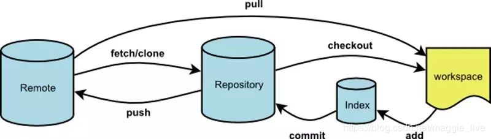
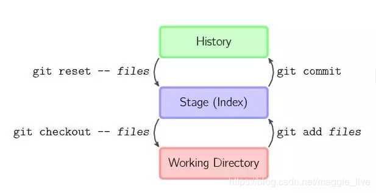

**版本控制**
git本质是一个分布式版本控制系统，客户端可以完成clone整个仓库，然后进行提交和修改。

### 一、了解github的工作流



**仓库**

1. 远程仓库(remote)：远程主仓库github；
2. 本地仓库(respository/history)：.git文件夹里还包括git自动创建的master分支，并且将HEAD指针指向master分支。使用commit命令可以将暂存区中的文件添加到本地仓库中；
3. 暂存区（Index/Stage）：在使用git管理项目文件的时候，其本地的项目文件会多出一个.git的文件夹，将这个.git文件夹称之为版本库。其中.git文件夹中包含了两个部分，一个是暂存区（Index或者Stage）,顾名思义就是暂时存放文件的地方，通常使用add命令将工作区的文件添加到暂存区里;
4. 工作区：本地电脑存放项目文件的地方。

### 二、git add提交到暂存区、出错怎么办？

提交流程为：

```mermaid
flowchat
st=>start: Workspace 工作区
git status=>operation: git statut 查看状态
git add=>operation: git add .将所有修改加入暂存区
git commit -m 'first commit'=>operation: git commit -m 'first commit'将代码提交到本地仓库
git push=>operation: git push将本地仓库代码更新到远程仓库
e=>end: Remote
st->git status->git add->git commit -m 'first commit'->git push->e
```

**场景1：**
当你改乱了暂存区某个文件的内容，想直接丢弃暂存区的修改时
>git checkout --<文件名>

**场景2：**
当你不但改乱了暂存区某个文件的内容，还添加到了本地仓库时，想丢弃修改
> 第一步 git reset HEAD file
> 第二步 git checkout <文件名>

### 三、git commit提交到本地仓库，出错怎么办？

#### 1.提交信息出错

更改`commit`信息
> git commit --amend -m 'new message'

#### 2.漏提交

commit时，遗漏提交部分更新，有两种解决方案

- 方案一：再次`commit`，此时，git上会出现两次`commit`
  > git commit -m 'message'

- 方案二：遗漏文件提交到之前`commit`上。--no-edit表示提交信息不会更改，在git上仅为一次提交

 > git add missed-file （missed-file 为遗漏提交文件）
 > git commit --amend --no-edit

#### 3.提交错误文件，回退到上一个commit版本，再commit

**git reset**
 把暂存区的修改撤销掉`unstage`，重新放回工作区
 > git reset HEAD <文件名> 

 git版本回退，回到到特定的`commit_id`版本，可以通过`git log`查看提交历史，以便确认要回退到哪个版本`commit`之后的即为ID
 > git reset --hard commit_id 

将版本库回退1个版本，不仅仅是将本地版本库的头指针全部重置到指定版本，也会重置暂存区，并且会将工作区代码也回退到这个版本
 > git reset --hard HEAD~1


 修改版本库，保留暂存区，保留工作区
将版本库软回退1个版本，软回退表示将本地版本库的头指针全部重置到指定版本，且将这次提交之后的所有变更都移动到暂存区。
> git reset --soft HEAD~1

**git revert**
撤销某次操作，此次操作之前和之后的`commi`t和`history`会保留，并且把这次撤销作为一次最新的提交

撤销前一次commit
> git revert HEAD

撤销前2次commit
> git revert HEAD^

撤销指定的版本，撤销也会作为一次提交进行保存。
> git revert commit

`git revert`是提交一个新的版本，将需要`revert`的版本的内容再方向修改回去，版本递增，不影响之前提交的内容

**`git revert`和`git reset`的区别**

- `git revert`是用一次新的commit来回滚之前的commit，`git reset`是直接删除指定的commit。
- 在回滚这一操作上看，效果差不多。但是在日后继续merge以前的老版本时有区别。因为`git revert`是用一次逆向的commit“中和”之前的提交，因此日后合并老的branch时，导致这部分改变不会再次出现，但是`git rese`t直接把某些commit在某个branch上删除，因而和老的branch再次merge时，这些被回滚的commit应该还会被引入。
- `git reset` 是把HEAD向后移动了一下，而`git revert`是HEAD继续前进，只是新的commit的内容和要revert的内容正好相反，能够抵消要被revert的内容。

### 四、常用命令

#### 1.初始化

- 新建本地仓库`git init`
- 克隆`git clone <url>`

#### 2.提交

- 提交所有`git add .`
- 提交指定文件`git add <file1> <file2>`
- 提交文件夹中所有文件到暂存区`git add [dir]`

#### 3.撤销

- 删除工作区文件，并且删除暂存区文件记录`git rm <file1> <file2>`
- 删除暂存区文件，工作区还存在`git rm --cached <file>`
- 取消暂存区已暂存文件`git reset HEAD <file`
- 撤销上一次对文件的操作`git checkout --<file>`

#### 4.暂存

- 添加缓存栈： `git stash` ;
- 查看缓存栈： `git stash list` ;
- 推出缓存栈： `git stash pop` ;
- 取出最新缓存：	`git stash apply`;
- 取出特定缓存内容： `git stash apply stash@{1}` 

#### 5.更新文件

- 重命令文件，并将已改文件提交暂存区：`git mv <file-origin> [file-rename>`;

#### 6.查看信息

- 查看当前工作区所有文件的状态: `git status`;
- 比较工作区中当前文件和暂存区之间的差异，修改之后没有暂存的内容：`git diff``
- 查看提交历史：`git log`；参数-p展开每次提交的内容差异，用-2显示最近的两次更新，如`git log -p -2`;

#### 7.提交文件到版本库

- 将暂存区中的文件提交到本地仓库中，即打上新版本：git commit -m "commit_info";
- 将所有已经使用git管理过的文件暂存后一并提交，跳过add到暂存区的过程：git commit -a -m "commit_info";
- 提交文件时，发现漏掉几个文件，或者注释写错了，可以撤销上一次提交：git commit --amend;

#### 8.标签

- 列出现在所有的标签：`git tag`;
- 使用特定的搜索模式列出符合条件的标签，例如只对1.4.2系列的版本感兴趣：`git tag -l "v1.4.2.*"`;
- 创建一个含附注类型的标签，需要加-a参数，如`git tag -a v1.4 -m "my version 1.4"`;
- 使用git show命令查看相应标签的版本信息，并连同显示打标签时的提交对象：`git show v1.4`;
- 如果有自己的私钥，可以使用GPG来签署标签，只需要在命令中使用-s参数：`git tag -s v1.5 -m "my signed 1.5 tag"`;
- 验证已签署的标签：`git tag -v `，如`git tag -v v1.5`;
- 创建一个轻量级标签的话，就直接使用git tag命令即可，连-a,-s以及-m选项都不需要，直接给出标签名字即可，如`git tag v1.5`;
- 将标签推送到远程仓库中：`git push origin` ，如`git push origin v1.5`；
- 将本地所有的标签全部推送到远程仓库中：`git push origin --tags`;

#### 9.分支

- 创建本地分支 `git branch 分支名`
- 查看本地分支`git branch`
- 查看远程分支 `git branch -a`
- 切换分支 `git checkout 分支名` (一般修改未提交则无法切换，大小写问题经常会有，可强制切换  `git checkout 分支名 -f`  非必须慎用)
- 将本地分支推送到远程分支 `git push <远程仓库> <本地分支>:<远程分支>`
- 从远程仓库中抓取本地仓库中没有更新`git fetch`
- 拉取远程分支仓库`git pull`
- 推送本地分支到远程分支`git push`
- 拉取远程新分支 `git checkout -b serverfix origin/serverfix`
- 合并本地分支 `git merge hotfix`：(将 hotfix 分支合并到当前分支)
- 合并远程分支 `git merge origin/serverfix`
- 删除本地分支 `git branch -d hotfix`：(删除本地 hotfix 分支)
- 删除远程分支 `git push origin --delete serverfix`
- 移除远程仓库	git remote rm [remote-name]`
- 上传新命名的本地分支：`git push origin newName`;
- 创建新分支：`git branch branchName`：(创建名为 branchName 的本地分支)
- 切换到新分支：`git checkout branchName`：(切换到 branchName 分支)
- 创建并切换分支：`git checkout -b branchName`：(相当于以上两条命令的合并)
- 查看本地分支：`git branch`
- 查看远程仓库所有分支：`git branch -a`
- 本地分支重命名： `git branch -m oldName newName`
- 重命名远程分支对应的本地分支：`git branch -m oldName newName`
- 把修改后的本地分支与远程分支关联：`git branch --set-upstream-to origin/newName`
- 修改远程仓库在本地的简称：`git remote rename [old-name] [new-name]`
- 查看远程仓库信息：`git remote show origin`

#### 10.查询配置信息

- 列出当前配置：`git config --list`
- 列出repository配置：`git config --local --list`
- 列出全局配置：`git config --global --list`
- 列出系统配置：`git config --system --list`

#### 11.配置用户信息

- 配置用户名：`git config --global user.name "your name"`;
- 配置用户邮箱：`git config --global user.email "youremail@github.com"`;

#### 12.其他配置

- 配置git命令输出为彩色的：`git config --global color.ui auto`;
- 配置git使用的文本编辑器：`git config --global core.editor vi`;

### 六、配置SSH

#### 1. 查看是否生成了 SSH 公钥

> $ cd ~/.ssh
$ ls
id_rsa      id_rsa.pub      known_hosts

复制代码其中 id_rsa 是私钥，id_rsa.pub 是公钥。

#### 2. 如果没有那就开始生成，设置全局的user.name与user.email

>git config --list // 查看是否设置了user.name与user.email，没有的话，去设置
// 设置全局的user.name与user.email
git config --global user.name "XX"
git config --global user.email "XX"

#### 3. 输入 `ssh-keygen` 即可（或`ssh-keygen -t rsa -C "email"`）

>$ ssh-keygen
Generating public/private rsa key pair.
Enter file in which to save the key (/Users/schacon/.ssh/id_rsa):
Enter passphrase (empty for no passphrase):
Enter same passphrase again:
Your identification has been saved in /Users/schacon/.ssh/id_rsa.
Your public key has been saved in /Users/schacon/.ssh/id_rsa.pub.
The key fingerprint is:

#### 4. 生成之后获取公钥内容，输入 `cat ~/.ssh/id_rsa.pub` 即可， 复制` ssh-rsa` 一直到 .local这一整段内容

>$ cat ~/.ssh/id_rsa.pub
ssh-rsa AAAAB3NzaC1yc2EAAAABIwAAAQEAklOUpkDHrfHY17SbrmTIpNLTGK9Tjom/BWDSU
GPl+nafzlHDTYW7hdI4yZ5ew18JH4JW9jbhUFrviQzM7xlELEVf4h9lFX5QVkbPppSwg0cda3
Pbv7kOdJ/MTyBlWXFCR+HAo3FXRitBqxiX1nKhXpHAZsMciLq8V6RjsNAQwdsdMFvSlVK/7XA
t3FaoJoAsncM1Q9x5+3V0Ww68/eIFmb1zuUFljQJKprrX88XypNDvjYNby6vw/Pb0rwert/En
mZ+AW4OZPnTPI89ZPmVMLuayrD2cE86Z/il8b+gw3r3+1nKatmIkjn2so1d01QraTlMqVSsbx
NrRFi9wrf+M7Q== schacon@agadorlaptop.local

#### 5. 打开 GitLab 或者 GitHub，点击头像，找到设置页左侧找到 SSH keys 按钮并点击，输入刚刚复制的公钥即可

**参考**
 [洁癖者用 Git：pull --rebase 和 merge --no-ff](http://hungyuhei.github.io/2012/08/07/better-git-commit-graph-using-pull---rebase-and-merge---no-ff.html)$npsb;
[最常见的 Git 问题和操作清单汇总](https://juejin.im/post/5d5d61e96fb9a06ace5254bd)$nbsp;

[git基本操作，一篇文章就够了！](https://juejin.im/post/5ae072906fb9a07a9e4ce596)$nbsp;